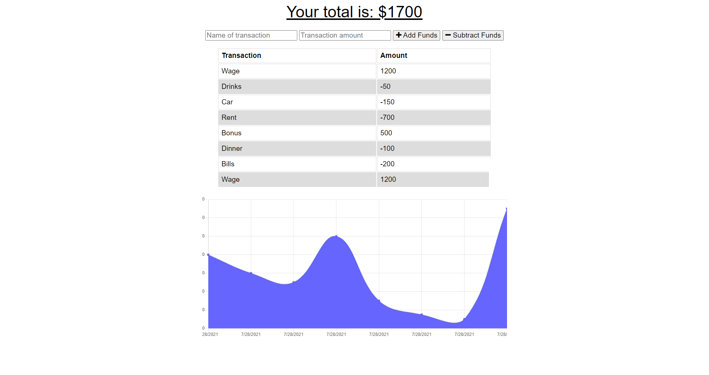

## 19 Online / Ofline Budget Tracker

UCSD-SD-FSF-PT-03-2021-U-C-MW

[Github Link](https://github.com/djony88/19_Online-Ofline_Budget_Tracker)

[Deployed App](https://shrouded-refuge-70825.herokuapp.com/)

# Requirements:

* Add functions to Budget Tracker to allow for offline access.
* When entering transactions offline to be able to update total when it's back online.
* As traveling you will be able to track withdrawals and deposits without using internet connection, once you are connected to the internet connection it will automaticly update offline imports.

# Installation:

* `npm start` or just by clicking on `Deployed App` :).

